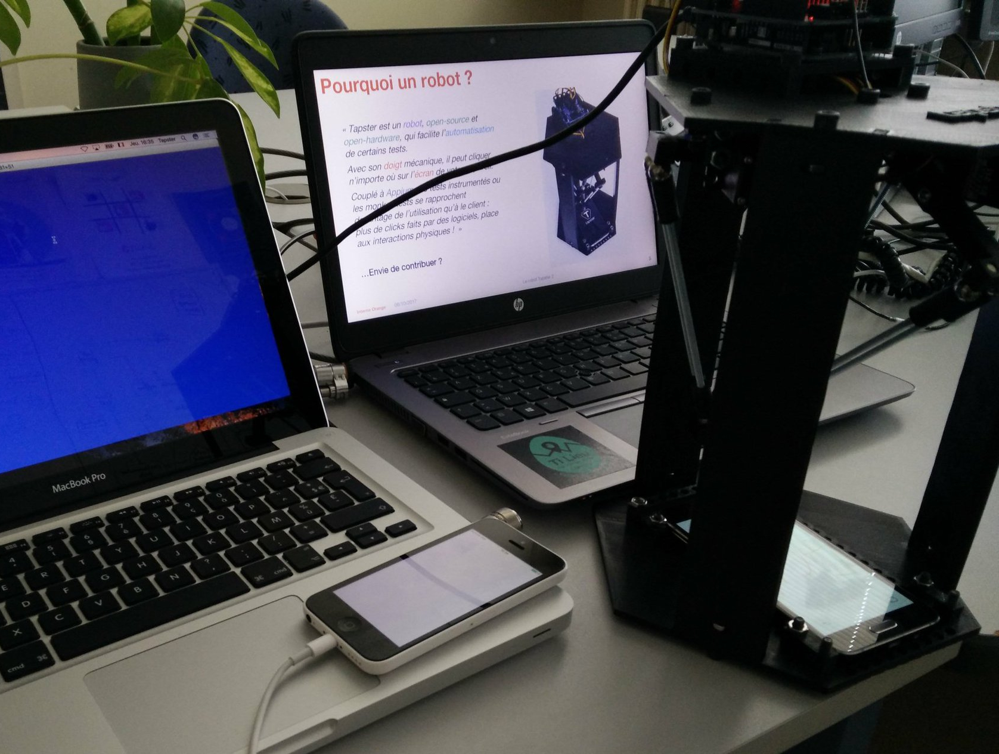

# Tapster - Mobile Automation Robot

# Why using such bot?
- Bring fun in your office
- Gring automation four your tests
- Extend your software-based instrumented tests (UI Automator, Espresso, Kakao, Appium or whatever) with hardware-based tests

# Dependencies
- Node.js (8.6.0) (required)
- npm (5.3.0) (required)
- nvm (0.33.4)
- one Tapster robot

# If you are using Tapster with Appium
- Do not install Appium or Node.js with sudo
- Since massive refactoring (1.4 -> 1.5), only Appium 1.4 supports Tapster bot
- Work is in progress to add drivers to Appium
- You can read the following thread: https://discuss.appium.io/t/integration-of-tapster-2-to-appium/19010
- You can read the following issue: https://github.com/appium/appium/issues/9367
- Feel free to help the community behind Tapster so as to bring fun, automation and bot on your desk!

# Some references and things to see
- http://www.tapster.io
- https://twitter.com/tapsterbot
- https://www.tindie.com/products/hugs/tapster/
- https://github.com/hugs/tapsterbot
- https://github.com/tapsterbot/tapsterbot
- https://github.com/appium/appium
- https://github.com/appium/robots
- https://github.com/penguinho/tapsterbot
- https://www.slideshare.net/PierreYvesLapersonne/why-not-tapster

# Getting Started
1. Download and install the Arduino Client: [http://arduino.cc/en/Guide/HomePage](http://arduino.cc/en/Guide/HomePage)
2. Follow the setup procedure, and use the "blink" test script to verify your Arduino is working.
3. From the Arduino IDE upload the "Firmata" script: File -> Open -> Examples > Firmata > StandardFirmata
4. Install the dependencies: `cd software; npm install`
5. Start'er up: `node src/bot.js`
6. Start moving: `go(0,0,-140)`
